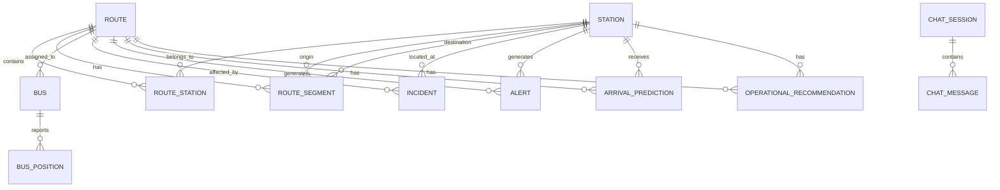

# Modelo E-R MetroFlow Backend

```mermaid
erDiagram
    STATION ||--o{ ROUTE_STATION : belongs_to
    ROUTE ||--o{ ROUTE_STATION : contains
    ROUTE ||--o{ ROUTE_SEGMENT : has
    STATION ||--o{ ROUTE_SEGMENT : origin
    STATION ||--o{ ROUTE_SEGMENT : destination
    ROUTE ||--o{ BUS : assigned_to
    BUS ||--o{ BUS_POSITION : reports
    ROUTE ||--o{ INCIDENT : affected_by
    STATION ||--o{ INCIDENT : located_at
    ROUTE ||--o{ ALERT : generates
    STATION ||--o{ ALERT : generates
    ROUTE ||--o{ ARRIVAL_PREDICTION : has
    STATION ||--o{ ARRIVAL_PREDICTION : receives
    ROUTE ||--o{ OPERATIONAL_RECOMMENDATION : has
    STATION ||--o{ OPERATIONAL_RECOMMENDATION : has
    CHAT_SESSION ||--o{ CHAT_MESSAGE : contains
```

MySQL es la fuente de verdad transaccional. ChromaDB solo indexa documentos derivados para busqueda semantica.

